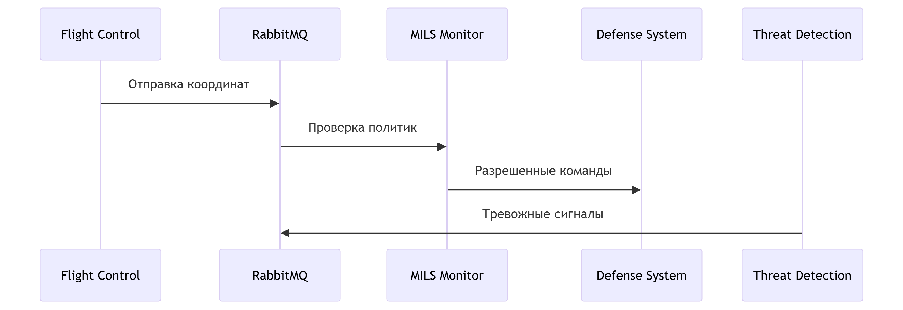

# 🛡️ Кибериммунный дрон "Страж-птица" 
**Реализация системы безопасности на базе MILS/FLASK**  

[](https://opensource.org/licenses/MIT)

---

## 📋 Требования
- **Docker 20.10+**  
- **Docker Compose 1.29+**  
- **Python 3.8+**  
- Библиотеки:  
  ```bash
  pika==1.3.1
  docker==6.1.2
  ```
  
## 🚀 Быстрый старт

### 1. Клонируйте репозиторий

 ```bash
git clone https://github.com/your-repo/cyberimmune-drone.git
cd cyberimmune-drone
```

### 2. Настройте окружение
 ```bash
python -m venv venv
source venv/bin/activate  # Linux/MacOS
venv\Scripts\activate    # Windows
pip install -r requirements.txt
```

### 3. Запустите инфраструктуру

```bash
docker-compose up -d
sleep 10  # Ожидание инициализации RabbitMQ
```

### 4. Запустите систему

```bash
python shablon-strazh-ptica.py
```
----------

## 🐳 Docker Compose

Создайте файл  `docker-compose.yml`:

```yaml
version: '3.8'

services:
  rabbitmq:
    image: rabbitmq:management
    ports:
      - "5672:5672"
      - "15672:15672"
    networks:
      - mils_network

networks:
  mils_network:
    driver: bridge
```
----------

## 🏗 Архитектура

### Компоненты системы


| Компонент  | Роль |
| ------------- | ------------- |
| MILS Monitor  | Центральный монитор безопасности  |
| Flight Control  | Управление полетом  |
| Threat Detection  | Обнаружение угроз  |
| RabbitMQ  | Брокер сообщений  |

### Схема взаимодействия



## ⚙ Конфигурация

### Файл политик (`config/policies.yaml`)
```yaml
components:
  flight_control:
    allowed_actions: 
      - position_update
      - emergency_stop
    destinations:
      - air_traffic
      - monitor

  threat_detection:
    allowed_actions:
      - threat_alert
    destinations:
      - defense_system
```

## 🔍 Проверка работы

1.  **Мониторинг RabbitMQ**:  
    Откройте в браузере:  `http://localhost:15672`  (логин:  `guest`, пароль:  `guest`).
    
2.  **Пример логов**:
```
2023-10-05  12:00:00  -  INFO  - APPROVED:  {'source':  'flight_control',  'action':  'position_update'}  
2023-10-05  12:00:03  -  WARNING  - DENIED:  {'source':  'threat_detection',  'action':  'invalid_action'}
```

